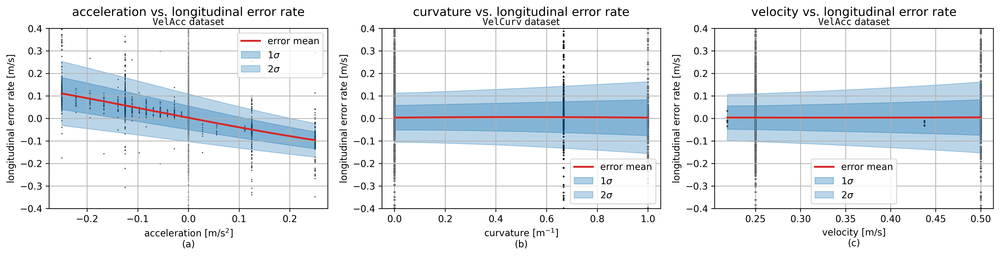
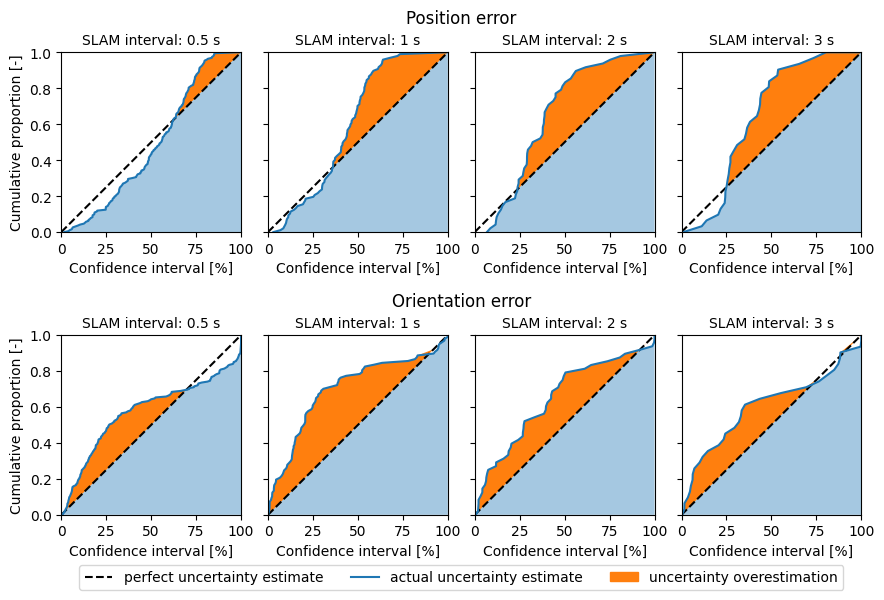

If you are viewing this in Azure DevOps, view on GitHub to see the images: [https://github.com/christiaantheunisse/Foresee-Error-Models](https://github.com/christiaantheunisse/Foresee-Error-Models)

# Foresee-Error-Models
This repo contains all the data and code to generate the error models discussed in *[Evaluating Set-based Occlusion Planners in Traffic Scenarios with Perception Uncertainties](paper.pdf)*. Besides, the data and code to generate the plots for the experiment section are also included. The abstract of the paper is:

> To ensure safely operation of autonomous vehicles (AVs), trajectory planners should account for occlusions. These are areas invisible to the AV that might contain vehicles. Set- based methods can guarantee safety by calculating the reachable set, which is the set of possible states, for each potentially hidden vehicle. A recently published method proved in simulation experiments to reduce the cautiousness by reasoning about these occluded areas over time, assuming perfect input data [[1]](https://ieeexplore.ieee.org/abstract/document/9827171/). We  present a novel algorithm that uses this reasoning and is applicable on a real AV with its accompanying uncertainties and imperfect sensor data. The uncertainties include sensor errors and noise, computation and communication delays and control errors in the trajectory following. This is achieved by modelling the error distributions and accounting for them in the calculations, where the confidence interval for each error is exposed as a setting. Experiments indicate that our algorithm can reduce the traversal time through an intersection by 2.2 seconds with reasoning. An ablation study of the different error measures shows that the errors in the construction of the field of view (FOV) limit the performance the most. Reducing the errors in the FOV construction is therefore our the most important recommendation, besides making the method interaction-aware.

[1] : Sánchez, J. M. G., Nyberg, T., Pek, C., Tumova, J., & Törngren, M. (2022, June). Foresee the unseen: Sequential reasoning about hidden obstacles for safe driving. In 2022 IEEE Intelligent Vehicles Symposium (IV) (pp. 255-264). IEEE. [link](https://ieeexplore.ieee.org/abstract/document/9827171/)

# Error models

## Gaussian Process

Gaussian Processes (GPs) are used for the error models because of the following advantages:
- Nonparametric, so no assumption about the data structure
- Simulateneous fitting of the error mean and variance
- Modelling of the epistemic uncertainty (model uncertainty), so basically overapproximating the error variance.
- Hyperparameters can be optimized with log-likelihood maximization (instead of the model itself like NNs).

Since online inference on Gaussian Processes is too time consuming, a lookup table is generated that is linearly interpolated.

## Lidar
A Lidar measurement consists of a list of angles and the range measured at each angle. Two models are generated: one for the distribution of the error in the ranges and one for the angles. Both models depend on the measured range and inclination angle. Furthermore, the maximum inclination angle is determined from these angles.

### Range error
> **Definition** (Range error). *The difference between the measured range and the true range.*

To visualize the data and fit a GP, run the code in `lidar/range_error/range_error.ipynb`.

    <!-- 
     -->
    
    

### Angle error
> **Definition** (Angle error). *The difference between the reported angle for a range measurement and the true angle.*

To visualize the data and fit a GP, run the code in `lidar/angle_error/angle_error.ipynb`.

    <!-- 
     -->
    
    

## Trajectory following

First, we need to find the relation between the parameters *velocity* $v$, *acceleration* $a$ and *curvature* $kappa$ and the three trajectory following errors: *longitudinal rate*, *lateral* and *orientation*. Two datasets are composed with data for the different parameters:

- `VelAcc`: Varying velocity and acceleration, but constant curvature ($\kappa = 0$)
- `VelCurv`: Varying velocity and curvature, but constant acceleration ($a = 0$)

In the below plot the data is plotted against the errors and Gaussian Processes are fitted to be able to properly assess the relations.

### Longitudinal error

The time derivative of the longitudinal error is modelled, i.e. the longitudinal error rate, because the trajectory follower tracks the velocity. It is therefore better to measure the velocity error. The `VelAcc` dataset is used for the error model.

### Lateral error

The acceleration data is unreliable for the lateral error, because the test trajectories always start with a positive acceleration and lateral error of zero, resulting in a low lateral error for positive accelerations. Consequently, the `VelCurv` dataset is for the GP fit.

### Orientation error

The orientation error model also depends on the `VelCurv` dataset, because the correlation with the curvature is much stronger than with the orientation.

## Velocity error

The linear and angular velocity are, respectively, measured by the wheel encoders and IMU. The error distributions are modelled with a constant variance and a velocity dependent mean. The mean is used to remove the bias from (calibrate) the measurements and the variance is sent with to measurements to be used downstream in the extended Kalman filters.

### Wheel encoders

The true velocities are obtained with a tachometer, resulting in the following data:

### IMU

The true average velocity is calculated from the total orientation reported by the SLAM module over a period of 30 seconds. These are compared to the average of the velocities measured by the IMU. The variance is estimated with the Mean Square Successive Difference (MSSD).

## Pose estimation error

### EKF filter tuning
The noise covariance matrix Q of the EKF filter has to be properly tuned to ensure that the estimated uncertainty of the estimated pose is correct. The SLAM pose estimation was used as the true pose the calculate the error in the EKF pose. The plot below shows the cumulative proportion of the errors that was found for each confidence interval. More specifically, when the estimation of the uncertainty is conservative, at least x% of the errors should belong to the x%-confidence interval or better. This is everything above the black dashed lines in the plot.

In the [paper](#) it is argued that the fact that the SLAM pose is imperfect, makes the EKF **position** estimate appear worse. This is especially true when the uncertainty of the SLAM pose is relatively big compared to the EKF uncertainty, which is the case for small SLAM update intervals. This point supported by the plots for the position error.

# Experiments

More information about the robot and software used in the experiments can be found in the [paper](paper.pdf) and on [this GitHub with the mobile robot software](https://github.com/christiaantheunisse/Foresee-the-Unseen-ROS).

## Performance experiments: normal traffic scenarios

The traversal times for the four compared algorithms are. T-tests indicate that the traversal time improvement is significant for all scenarios for `foresee vs. baseline` and for `foresee++ vs. baseline++` for the scenarios 2, 3 and 6. A two-way ANOVA showed that the error models significantly increased the traversal time for both `baseline vs. baseline++` and `foresee and foresee++`.

## Ablation study: normal traffic scenarios

The traversal times for the normal traffic scenarios in the ablation study. The Tukey's HSD test indicates that `foresee abl. FOV` and `Lidar` are significantly less cautious than `foresee abl. delay` and `traj`. This leads to the conclusion that the errors in the field of view (FOV) and Lidar contribute the most to the increased cautiousness. 

    <!-- 
     -->
    
    

## Horizon lengths

This experiments shows that a longer time horizon results in a bigger traversal time, because the method is not interaction-aware. For a horizon of 30, the mobile robot cannot even cross the intersection because it collides with possible hidden obstacles at the boundary of the maximum field of view.

