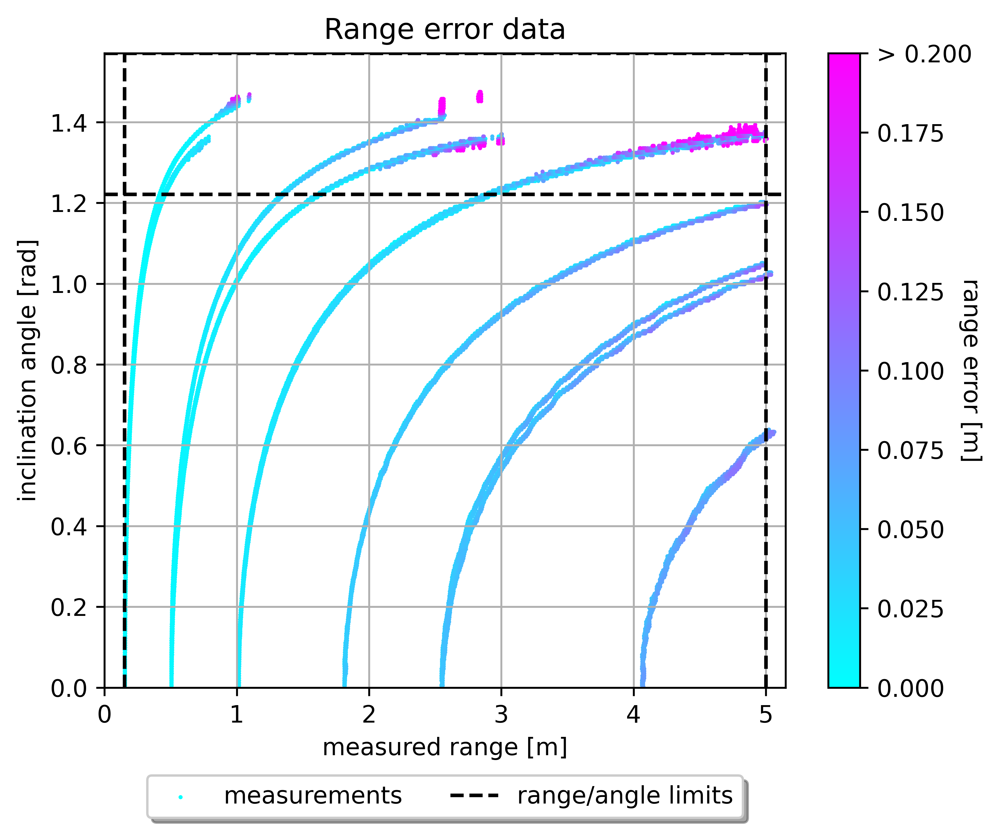
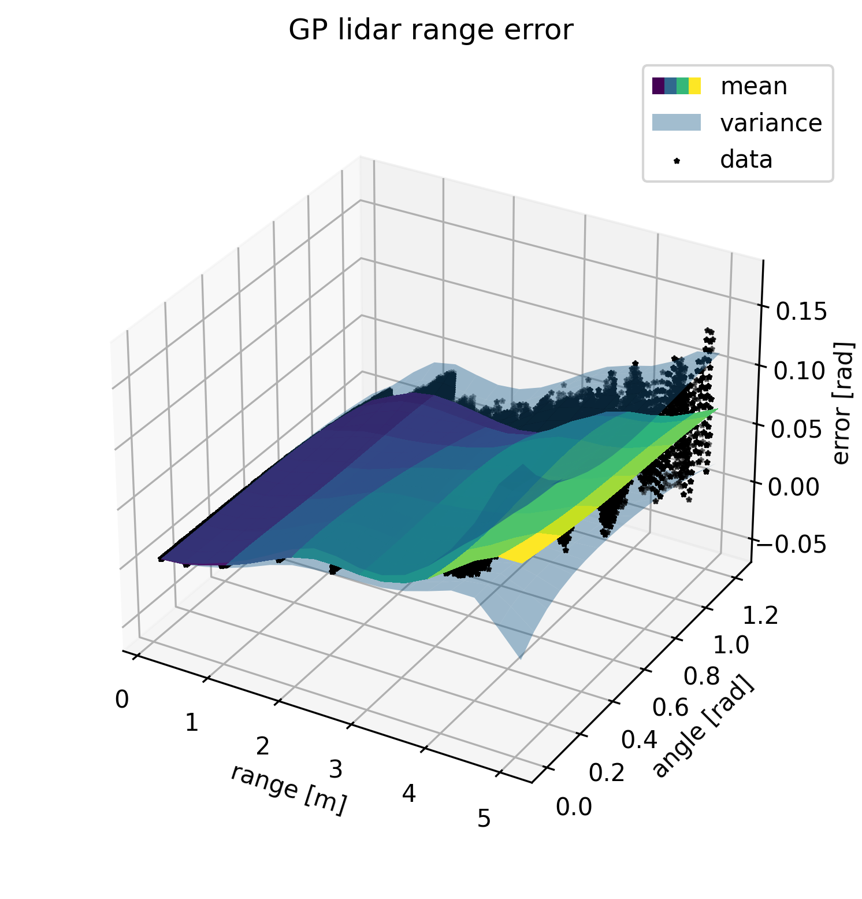

# Foresee-Error-Models
This repo contains all the data and code to generate the error models for the [paper](). 

## Gaussian Process

Gaussian Processes (GPs) are used for the error models because of the following advantages:
- Nonparametric, so no assumption about the data structure
- Simulateneous fitting of the error mean and variance
- Modelling of the epistemic uncertainty (model uncertainty), so basically overapproximating the error variance.
- Hyperparameters can be optimized with log-likelihood maximization (instead of the model itself like NNs).

Since online inference on Gaussian Processes is too costly, the models is sampled over a grid of 1000 steps for each parameter dimension. The values on this grid are linearly interpolated online.

## Lidar
A Lidar measurement consists of a list of angles and the range measured at each angle. Two models are generated: one for the distribution of the error in the ranges and one for the angles. Both models depend on the measured range and inclination angle. Furthermore, the maximum inclination angle is determined from these angles.

### Range error
> **Definition** (Range error). *The difference between the measured range and the true range.*

To visualize the data and fit a GP, run the code in `lidar/range_error/range_error.ipynb`.

    
    

### Angle error
> **Definition** (Angle error). *The difference between the reported angle for a range measurement and the true angle.*

To visualize the data and fit a GP, run the code in `lidar/angle_error/angle_error.ipynb`.

    
    

## Trajectory following

First, we need to find the relation between the parameters *velocity* $v$, *acceleration* $a$ and *curvature* $kappa$ and the three trajectory following errors: *longitudinal rate*, *lateral* and *orientation*. Two datasets are composed with data for the different parameters:

- `VelAcc`: Varying velocity and acceleration, but constant curvature ($\kappa = 0$)
- `VelCurv`: Varying velocity and curvature, but constant acceleration ($a = 0$)

In the below plot the data is plotted against the errors and Gaussian Processes are fitted to be able to properly assess the relations.

### Longitudinal error

### Lateral error

### Orientation error

## Velocity error

The linear and angular velocity are, respectively, measured by the wheel encoders and IMU. The error distributions are modelled with a constant variance and a velocity dependent mean. The mean is used to remove the bias from (calibrate) the measurements and the variance is sent with to measurements to be used downstream in the extended Kalman filters.

### Wheel encoders

The true velocities are obtained with a tachometer, resulting in the following data:

### IMU

The true average velocity is calculated from the total orientation reported by the SLAM module over a period of 30 seconds. These are compared to the average of the velocities measured by the IMU. The variance is estimated with the Mean Square Successive Difference (MSSD).

## Pose estimation error

### EKF filter tuning
The noise covariance matrix Q of the EKF filter has to be properly tuned to ensure that the estimated uncertainty of the estimated pose is correct. The SLAM pose estimation was used as the true pose the calculate the error in the EKF pose. The plot below shows the cumulative proportion of the errors that was found for each confidence interval. More specifically, when the estimation of the uncertainty is conservative, at least x% of the errors should belong to the x%-confidence interval or better. This is everything above the black dashed lines in the plot.

In the [paper](#) it is argued that the fact that the SLAM pose is imperfect, makes the EKF **position** estimate appear worse. This is especially true when the uncertainty of the SLAM pose is relatively big compared to the EKF uncertainty, which is the case for small SLAM update intervals. This point supported by the plots for the position error.

